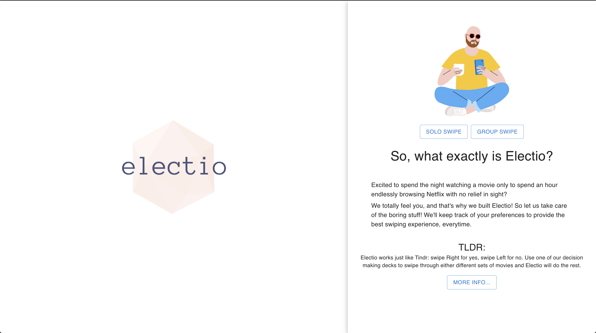

# Electio: Tindr for Micro Decisions

_[link to original project board](https://github.com/users/nar2163/projects/1_

**NOTE:** _as of MUI 4.9.0 `makeStyles` and `createStyles` have been deprecated and replaced with the [styled() utility](https://mui.com/system/styled/). Slowly migrating everything over, for now still a WIP... in fact, everything is a work in progress please and thank you. currently building build and swipe services and ui_

Excited to spend the night watching a movie only to spend an hour endlessly browsing Netflix with no relief in sight? We all waste time making simple decisions, but compounded over time that time can add up significantly. For example, [studies](https://www.pcmag.com/news/netflix-users-waste-ton-of-time-searching-for-something-to-watch) have shown an average of 30 minutes a day on a single decision, such as what to watch on Netflix. That would mean after one year, a person could have wasted up to 180 hours (about 1 week) on deciding what to fall asleep to on Netflix...

That's why I built Electio! Electio works just like Tindr: swipe Right for yes, swipe Left for no. Use one of our decision making decks to swipe through either different sets of movies and Electio will do the rest.

_What are you swiping through exactly?_
Electio allows you to build your own custom "decks" providing as little or as much information as you would like. Electio then let's you choose between a suite of swiping styles (for both solo and group swiping) to make your micro-decision as quickly and effectively as possible.

## Prerequisites

In order to run this program, you will need to have the following tools pre-installed on your system:

- Node.js - PostgreSQL
- npm

## Installation

1. Clone the repository: `git clone https://github.com/username/repositoryname.git`
2. Navigate to the project directory: `cd theo-captcha`
3. Install the required dependencies: `npm install`

## Running the Application in a Dev environment

Once the dependencies have been installed, you can run the application with the following command from the `server` directory:

`npm run dev`

This will launch the development server and the front end server running concurrently starting the application.
